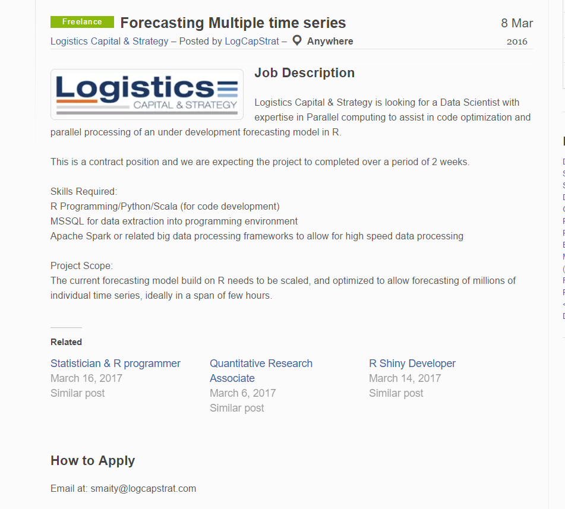
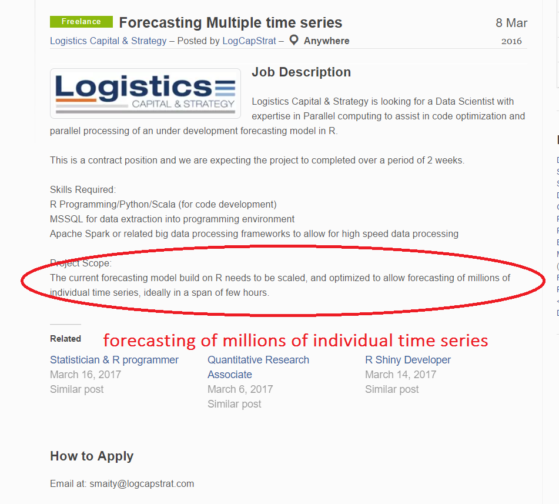
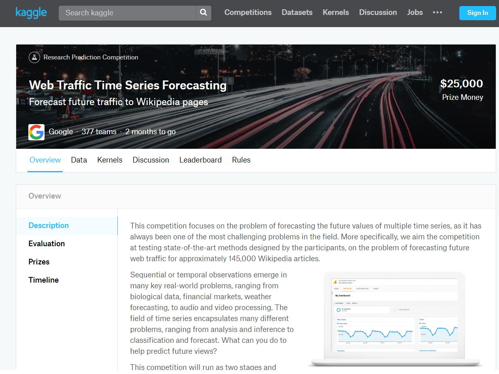
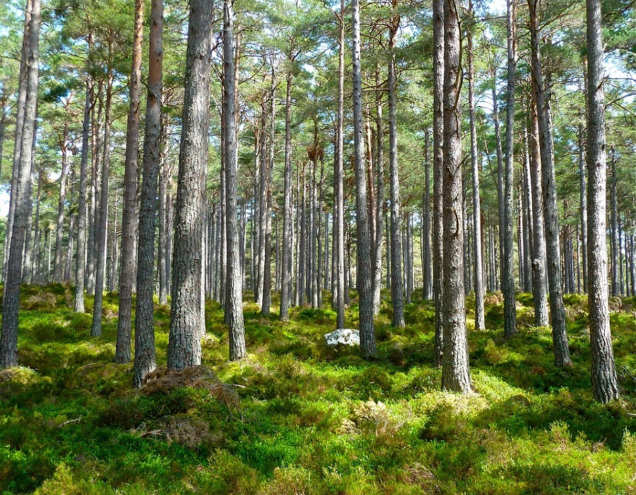

```{r setup, include=FALSE}
knitr::opts_chunk$set(echo = FALSE, message=FALSE, warning=FALSE, cache=TRUE, dev.args=list(bg=grey(0.9), pointsize=11))
```


## Large collections of time series


## Large collections of time series


## Large collections of time series


## Large collections of time series
\centerline{\includegraphics{ama1.png}}

## Forecasting multiple time series

  \begin{itemize}[<+->]
\item Aggregate selection rule
\begin{itemize}[<+->]
    \item Develop a single method which provides better forecasts across all time
series.
    \item No free lunch!
    \end{itemize}
\item Individual model building or combined forecasts
    \end{itemize}

## Automatic time series forecasting

\centerline{\includegraphics[height=1.7in]{fig5.png}}

- ets algorithm 
- auto.arima algorithm 

##ets() and auto.arima() in R
\vspace{0.3cm}
\begin{columns}
\begin{column}{0.48\textwidth}
ets algorithm\\[.2cm]
   \begin{itemize}
    \item Apply each 15 ETS models that are appropriate to the data
    \end{itemize} 
\end{column}
\begin{column}{0.48\textwidth}
auto.arima algorithm\\[.2cm]
   \begin{itemize}
    \item Use stepwise search to traverse model space, starting with a simple model
    \end{itemize} 
\end{column}
\end{columns}
\vspace{0.5cm}

###
* For each model, optimize parameters using MLE
* Select best method using AICc


## ets() and auto.arima() in R
\vspace{0.3cm}
\begin{columns}
\begin{column}{0.48\textwidth}
ets algorithm\\[.2cm]
   \begin{itemize}
    \item \textcolor{yellow}{Apply each 15 ETS models that are appropriate to the data}
    \end{itemize} 
\end{column}
\begin{column}{0.48\textwidth}
auto.arima algorithm\\[.2cm]
   \begin{itemize}
    \item \textcolor{yellow}{Use stepwise search to traverse model space, starting with a simple model}
    \end{itemize} 
\end{column}
\end{columns}
\vspace{0.5cm}
###
* For each model, optimize parameters using MLE
* Select best method using AICc


## 
\begin{block}{Motivation}
Reid(1972) pointed out that the performance of various forecasting methods changes according to the \textcolor{red}{nature  of data} and if the reasons for these variations are explored they may be useful in selecting the most appropriate model.
\end{block}\pause

\begin{block}{Objective}
Develop a framework that automates the selection of the most appropriate forecasting model for a given time series by using a large array of features computed from the time series.
\end{block}

## Time series features

\textcolor{yellow}{Cognostics}: \textcolor{yellow}{Co}mputer-aided dia\textcolor{yellow}{gnostics}\newline
\hspace{1in}(John W. Tukey, 1985)

\begin{itemize}[<+->]
\item Characteristics of time series

\item Depending on the research goals and domains, a variety of features have been introduced

\item Examples for time series features

\begin{itemize}[<+->]
    \item strength of trend
    \item strength of seasonality
    \item lag correlation
    \item spectral entropy

\end{itemize}

\end{itemize}

## Methodology: "offline" part of the algorithm

\centerline{\includegraphics[height=4.5in]{method1.png}}

## Methodology: "online" part of the algorithm

\centerline{\includegraphics[height=4.5in]{method2.png}}

## Methodology: reference set

\centerline{\includegraphics[height=4.5in]{m1.png}}

## Augmenting the reference set with simulated series

* when our sample is too small to build a reliable classifier
    
* when we wish to add more of some types of time series to the training set in order to get a more balanced sample


* How? 

\centerline{\includegraphics[height=2in]{sim2.png}}


## Methodology: features and class labels

\centerline{\includegraphics[height=4.5in]{m3.png}}

## Methodology: random forest

\centerline{\includegraphics[height=4.5in]{m4.png}}

## {.fullslide}


## Random forest
\centerline{\includegraphics[height=4.5in]{rf2.png}}

## Preliminary study

\begin{itemize}[<+->]
\item We consider non-seasonal time series

\item Data: Yearly time series of M1 and M3 competitions

\begin{itemize}[<+->]
    \item Classification algorithm - yearly series of M3 competition
    \item Evaluation - yearly series of M1 competition  
    
 \end{itemize}  
\item Class labels

\begin{itemize}[<+->]
    \item We consider random walks, white noise, ARIMA processes and ETS processes
    \item The model with the smallest MASE
    
    \end{itemize}
 \end{itemize}
 
## Time series feature
\vspace{0.3cm}
\begin{columns}
\begin{column}{0.48\textwidth}
   \begin{itemize}
    \item Strength of trend
    \item Spectral entropy
    \item Hurst exponent
    \item Lyapunov exponent
    \item Parameter estimates of Holt linear trend model
    \end{itemize} 
\end{column}
\begin{column}{0.48\textwidth}
   \begin{itemize}
    \item Length
    \item Coefficient of determination of the linear trend model
    \item ACF and PACF based features - calculated on both the raw and differenced series
    \end{itemize} 
\end{column}
\end{columns}
\vspace{0.5cm}

## Results: Distribution of MASE
```{r}
library(ggplot2)
library(tidyverse)
library(readr)
library(reshape)
Mase <- read_csv("MASEppt.csv")
MASE1 <- Mase %>% select(2:6,9)
#head(Mase)
MASE1 <- as.data.frame(MASE1)
names(MASE1) <- c("auto.arima 3.47", "ets 3.69", "WN 10.01", "RW 4.89", "RD 3.49", "RF 3.42")

meltData <- melt(MASE1)

names(meltData) <- c("Method", "MASE")
meltData$Method <- as.factor(meltData$Method)
levels(meltData$Method) <- gsub(" ", "\n", levels(meltData$Method))
meltData$Method <- as.factor(meltData$Method)
p <- ggplot(meltData, aes(x=Method, y=MASE))
sp <- p+geom_boxplot()+theme(axis.text=element_text(size=12),
        axis.title=element_text(size=16,face="bold"))+theme(axis.title.x=element_blank(),
        axis.text = element_text(size = 14)
     )
sp

```


## What next?

\begin{itemize}[<+->]
\item Develop a more comprehensive set of features that are useful in identifying different data generating processes.

\item Extend the time series collection to non-seasonal data.

\item Test for several large scale real time series data sets.

\item Consider other classification methods.

\end{itemize}

## Acknowledgement

The Victorian Branch of the Statistical Society of Australia Inc. (SSA Vic) 

##
Slides shared online at: https://github.com/thiyangt/YSC-2017

\vspace{3cm}

thiyanga.talagala@monash.edu


